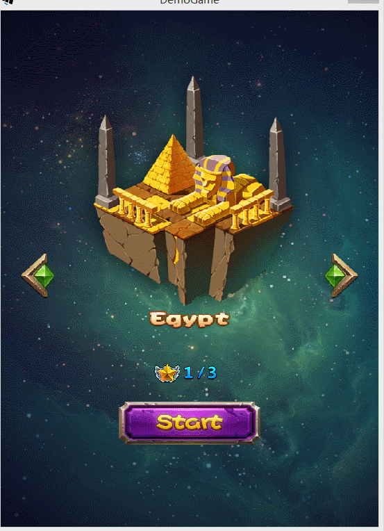
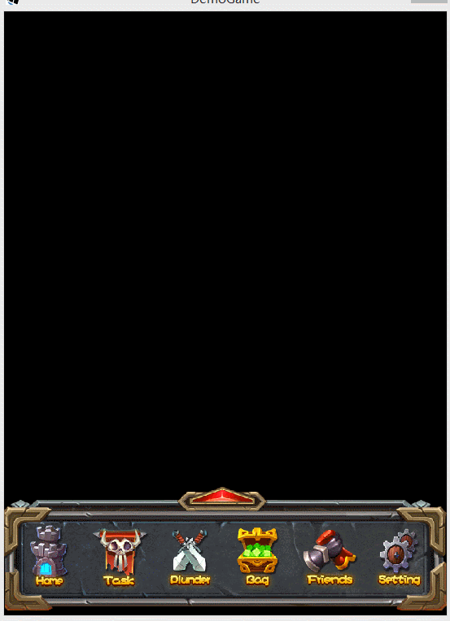

[](https://travis-ci.org/varFamily/cocos-ui-libgdx)
[](https://coveralls.io/github/varFamily/cocos-ui-libgdx?branch=master)
[](https://github.com/varFamily/cocos-ui-libgdx)
[](http://www.apache.org/licenses/LICENSE-2.0)
[](https://jitpack.io/#varFamily/cocos-ui-libgdx)

## 存档状态
由于Cocos Studio已经处于实质上被官方放弃的状态，本项目不再维护。

##cocos-ui-libgdx
* 在libGDX中使用Cocos Studio
* 基于[cocostudio-ui-libgdx](https://github.com/121077313/cocostudio-ui-libgdx)修改而来。

## 展示





##特性
* 支持最新版的[Cocos Studio](http://www.cocos.com/download/)进行开发，版本号v3.10
* 仅支持Cocos Studio的Json格式，请在发布项目时选择Json格式
* 支持Cocos Studio中大部分控件
* 部分支持Cocos Studio的粒子效果
* 部分支持Cocos Studio的动画效果，包括位移动画，缩放动画，帧动画（倾斜动画不支持）

## 快速入门
本项目目前没有发布正式版本，只有`0.1.1-snapshot`版。

在`build.gradle`中添加

``` groovy
    repositories {
       mavenCentral()
       maven { url 'https://jitpack.io' }
    }

    dependencies {
       compile 'com.github.varFamily:cocos-ui-libgdx:0.1.1'
       compile 'com.github.tianqiujie:nativefont:2.5.0'
    }
```
在代码中

``` java
FileHandle defaultFont = defaultFont = Gdx.files.internal("share/MLFZS.TTF");;
CocoStudioUIEditor editor = new CocoStudioUIEditor(
    Gdx.files.internal("demo/MainScene.json"), null, null, defaultFont, null);
Group group = editor.createGroup();
```

## 源码构建
项目使用gradle管理，直接运行`./gradlew build`即可。

如果需要运行demo，执行`./gradlew demo`即可。

##有问题反馈
在使用中有任何问题，欢迎用以下方式进行反馈

* 在Github中直接创建一个issue
* QQ群：[187378034](http://shang.qq.com/wpa/qunwpa?idkey=bbd0f15c6ba62dae8479d69dfcdce3816c18c684521b84a6ba4b7ce03a70d126)
* QQ: 634416025

## 下一步计划
+ 完善cocos2dx的粒子系统
+ 添加更多单元测试
+ 检测所有Cocos Studio的demo，确保没有遗漏


##感谢
+ 群友@Hey贡献了粒子解析效果的代码
