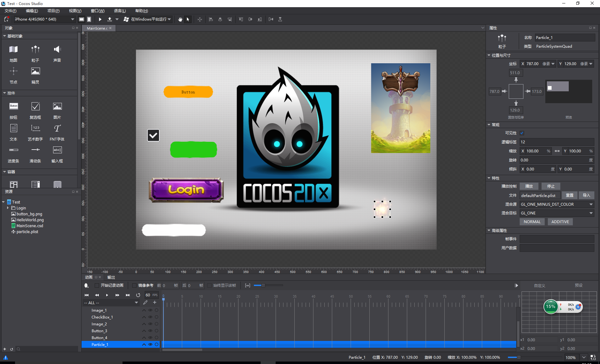

必须要下载cocostudio后设置 编辑-> 拖动修改尺寸

##cocostudio-ui-for-libgdx是什么?
* a ui library of ligdx with cocostudio
* Thank for the project: https://github.com/121077313/cocostudio-ui-libgdx
* 非常感谢cocostudio-ui-libgdx项目。这个项目是基于该项目修改的。

##cocostudio-ui-for-libgdx有哪些特性？

* 1.可以使用最新版的cocostudio进行开发 http://www.cocos.com/download/
* 2.修复了原版本的CheckBox，现在和cocos2dx里面的CheckBox一样的用法

##有问题反馈
在使用中有任何问题，欢迎反馈给我，可以用以下联系方式跟我交流

* 邮件(tqj.zyy#gmail.com, 把#换成@)
* QQ: 634416025
* QQ群：[187378034](http://shang.qq.com/wpa/qunwpa?idkey=bbd0f15c6ba62dae8479d69dfcdce3816c18c684521b84a6ba4b7ce03a70d126)
* weibo: [@纯洁的坏蛋](http://weibo.com/mwplay)
* twitter: [@badboy_tian](https://twitter.com/badboy_tian)

##捐助开发者
在兴趣的驱动下,写一个`免费`的东西，有欣喜，也还有汗水，希望你喜欢我的作品，同时也能支持一下。给个star

##感谢
感谢以下的项目,排名不分先后

* [121077313/cocostudio-ui-libgdx](https://github.com/121077313/cocostudio-ui-libgdx) 


##关于作者

```java
 String badboy = {
    name  : "纯洁的坏蛋",
    site : "http://www.i7play.com"
  }
```

# cocostudio-ui-for-libgdx
a ui library of ligdx with cocostudio

* Thank for the project: https://github.com/121077313/cocostudio-ui-libgdx
* 非常感谢cocostudio-ui-libgdx项目。这个项目是基于该项目修改的。


### 下一步计划
* 1.移植cocos2dx的粒子系统

### 希望
* 1.希望大家一起完善，为libgdx做出贡献