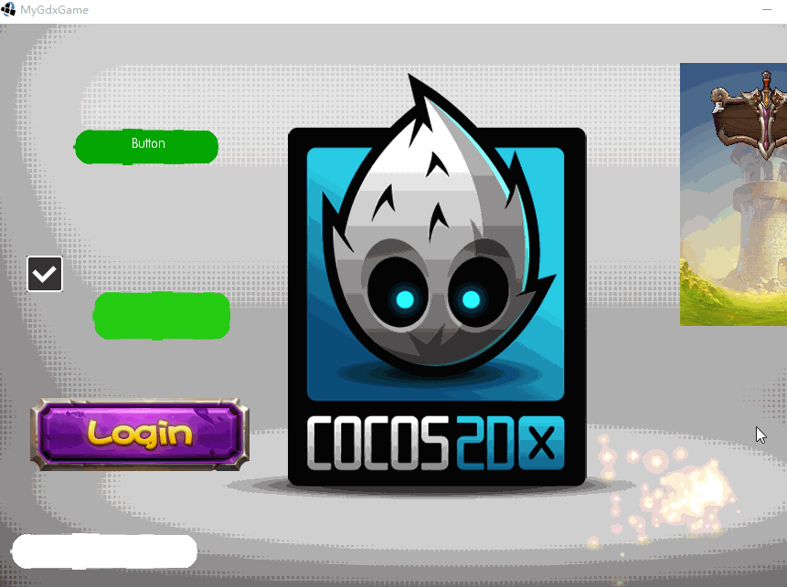
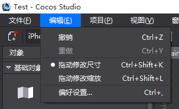

[](https://travis-ci.org/varFamily/cocos-ui-libgdx)
[](https://coveralls.io/github/varFamily/cocos-ui-libgdx?branch=master)
[](http://www.apache.org/licenses/LICENSE-2.0)

##cocostudio-ui-for-libgdx是什么?
* a ui library of ligdx with cocostudio
* Thank for the project: https://github.com/121077313/cocostudio-ui-libgdx
* 非常感谢cocostudio-ui-libgdx项目。这个项目是基于该项目修改的。

## 展示






必须要下载cocostudio后设置 编辑-> 拖动修改尺寸

##cocostudio-ui-for-libgdx有哪些特性？
* 1.可以使用最新版的cocostudio进行开发 http://www.cocos.com/download/
* 2.修复了原版本的CheckBox，现在和cocos2dx里面的CheckBox一样的用法
* 3.能解析cocostudio的粒子效果
* 4.支持cocostudio的动画，位移动画，缩放动画，帧动画（倾斜动画不支持）

## 源码构建
项目使用gradle管理，直接运行`./gradlew build`即可。如果需要运行demo，执行`./gradlew demo`即可。
## 编码使用
    repositories {
       mavenCentral()
       maven { url "https://oss.sonatype.org/content/repositories/snapshots/" }
    }

    dependencies {
       compile "net.mwplay:cocos-libgdx-ui:0.1.0-SNAPSHOT"
    }

##有问题反馈
在使用中有任何问题，欢迎反馈给我，可以用以下联系方式跟我交流

* 邮件(tqj.zyy#gmail.com, 把#换成@)
* QQ: 634416025
* QQ群：[187378034](http://shang.qq.com/wpa/qunwpa?idkey=bbd0f15c6ba62dae8479d69dfcdce3816c18c684521b84a6ba4b7ce03a70d126)
* weibo: [@纯洁的坏蛋](http://weibo.com/mwplay)
* twitter: [@badboy_tian](https://twitter.com/badboy_tian)

##捐助开发者
在兴趣的驱动下,写一个`免费`的东西，有欣喜，也还有汗水，希望你喜欢我的作品，同时也能支持一下。给个star

##感谢
感谢以下的个人或者项目,排名不分先后

* [121077313/cocostudio-ui-libgdx](https://github.com/121077313/cocostudio-ui-libgdx)
* 感谢群友@Hey对粒子效果的解析贡献
* 感谢群友[@315君](http://www.huangyunkun.com/)做出的努力


##关于作者

```java
 String badboy[] = {
    name  : "纯洁的坏蛋",
    site : "http://www.i7play.com"
  }
```

### 下一步计划
+ 完善cocos2dx的粒子系统
+ 添加单元测试

### 希望
+ 希望大家一起完善，为libgdx做出贡献
